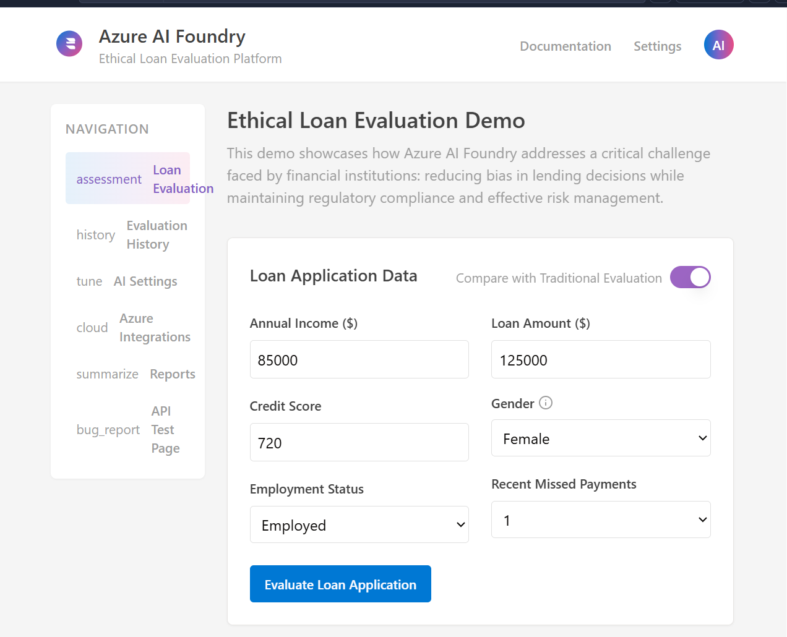

# Ethical Loan Evaluation Platform

## Powered by Azure AI Foundry

This application demonstrates how Azure AI Foundry can reduce bias in lending decisions while maintaining regulatory compliance and effective risk management.

## Features

- **Loan Application Evaluation:** Submit loan applications and see detailed results
- **Bias Comparison:** Compare traditional evaluations with AI-powered ethical evaluations
- **Detailed Analysis:** View factor-by-factor breakdown of lending decisions
- **Ethical AI Configuration:** Customize AI parameters for ethical loan evaluation

## Technologies Used

- **Frontend:** React, TailwindCSS, ShadCN UI
- **Backend:** Express.js, Node.js
- **Database:** PostgreSQL with Drizzle ORM
- **AI Integration:** Azure AI Foundry integration (simulated using OpenAI API)

## Getting Started

1. Clone the repository
2. Install dependencies: `npm install`
3. Set up environment variables (see `.env.example`)
4. Run the development server: `npm run dev`

## Screenshots

### Main Evaluation Interface

### Evaluation Results

## License

MIT
